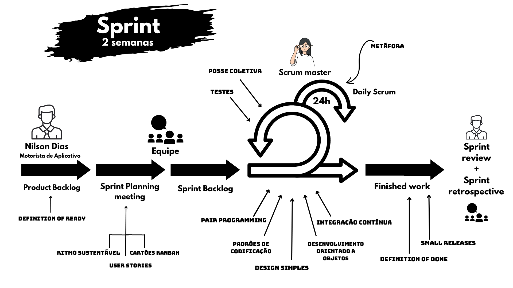

# Processo de Desenvolvimento de Software

Para garantir o sucesso do desenvolvimento durante o projeto, a equipe utilizará como ferramenta de organização a combinação de duas metodologias ágeis: Scrum e XP (Extreme Programming). O Scrum nos possibilitará gerenciar o processo de desenvolvimento em sprints curtos e iterativos, com reuniões e dinâmicas que acontecem com o objetivo de manter todos os membros da equipe alinhados e focados em relação ao projeto. Com o XP, iremos aplicar práticas de programação que asseguram a alta qualidade do código.

A seguir, seguem as principais práticas de ambos que utilizaremos no processo de desenvolvimento de software:

## Scrum
 - **Product Backlog**: Será elaborado pelos membros da equipe com apoio assíncrono do Product Owner, com quem será realizada uma conversa para analisar as prioridades e necessidades para com o produto e a equipe.

 - **Sprint Planning Meet**: A equipe decidirá em conjunto o Sprint Backlog, os horários e o formato das dailys da sprint em questão. Esta também será realizada com a participação assíncrona do Product Owner.

 - **Sprint Backlog**: Será realizado pela equipe, sem o auxílio do Product Owner, durante a reunião de planejamento do sprint. A equipe irá classificar os itens do backlog por dificuldade e selecionar, utilizando o sistema empurrado, os itens que serão desenvolvidos ao longo da próxima sprint.

 - **Duração das Sprints**: As sprints terão a duração de 2 semanas, 14 dias corridos. 

 - **Daily**: As dailys ocorrerão diariamente e serão realizadas de forma mista via mensagem de texto e canais de voz, de acordo com a disponibilidade de horário da equipe. Cada membro deve responder as perguntas a seguir: 
        - “O que você fez desde sua última daily?”
        - “Há algum impedimento ou obstáculo que esteja afetando o seu progresso?”
        - “O que você planeja fazer até a próxima?”

 - **Sprint Review** - Será realizada síncrona e assincronamente. Sendo a síncrona com a parte em que a equipe discute o que foi desenvolvido durante o sprint, essa reunião contará com a presença do Product Owner. Já na parte assíncrona o Product Owner testará a aplicação e nos enviará seus feedbacks.

 - **Sprint Retrospective** - Ao fim de cada sprints e entrega, equipe se reunirá para analisar o desenvolvimento realizado nas duas semanas anteriores, visando encontrar comportamentos prejudiciais e exprimir todas as opiniões com relação ao andamento do desenvolvimento do produto.

## XP (Extreme Programming)
* Práticas utilizadas:

   - **Pair Programming**: Conforme as atividades forem distribuídas e a agenda definida, os desenvolvedores que os horários livres combinarem irão se encontrar em algum local da faculdade (ou remoto com o auxílio da extensão ‘Live Share’ do VScode) para resolverem os issues previamente definidos no Github. Usaremos isso para aumentar o foco da parte dos programadores, facilitar e agilizar na solução de problemas e evitar erros, bugs e a necessidade da refatoração
    
   - **Padrões de codificação**: Além de seguir as boas práticas de programação, a equipe definirá padrões a serem seguidos ao longo do desenvolvimento do projeto, focando no desenvolvimento clean code. 

   - **Ritmo Sustentável**: Os desenvolvedores ficarão responsáveis por itens do backlog de acordo com a dificuldade do item a ser desenvolvido e sua disponibilidade de tempo para a sprint em questão. Desta forma nenhum membro ficará sobrecarregado.
    
   - **Metáfora**: Será utilizada para que toda a equipe possa entender os itens do produto e se comunicar de forma mais clara e precisa.  Além disso, permitirá uma comunicação mais efetiva na relação equipe-cliente. Entre os métodos a serem utilizados para o uso de metáfora estão os cartões kanban.
    
   - **Integração Contínua**: Para automatizar as mudanças de código de todos os membros da equipe em único projeto. Permitindo que os membros consigam mesclar os seus códigos onde os builds e os testes serão executados;
    
   - **Design simples**: O código se manterá legível e compreensível a fim de facilitar a elaboração de testes unitários e automatizados, além de garantir um Mínimo Produto Viável.
   
   - **Desenvolvimento orientado a objetos**: Para aumentar a eficiência, minar a redundância de código, facilitar no desenvolvimento, debug e manutenção do produto práticas orientadas a objetos serão utilizadas.
    
   - **Testes**: Inicialmente, serão utilizados testes unitários e automatizados a fim de agilizar o processo de implantação das funcionalidades. Porém, caso haja necessidade, o Desenvolvimento Orientado a Testes (TDD) será aplicado.
Propriedade Coletiva: Todos os membros terão acesso, obrigações e responsabilidades com o código. Entretanto, para realizar commits na main branch será necessária a aprovação de duas pessoas de chapters diferentes.

   - **Small releases**: Serão liberadas pequenas atualizações do aplicativo ao longo do desenvolvimento para que o cliente possa avaliar e passar o feedback das funcionalidades entregues.

* Práticas não utilizadas:
   - **Refatoração**: Há uma falta de segurança na refatoração, correríamos o risco de se manter muito tempo na mesma atividade. Por isso, manteremos padrões de codificação e designs simples desde o início do desenvolvimento.

