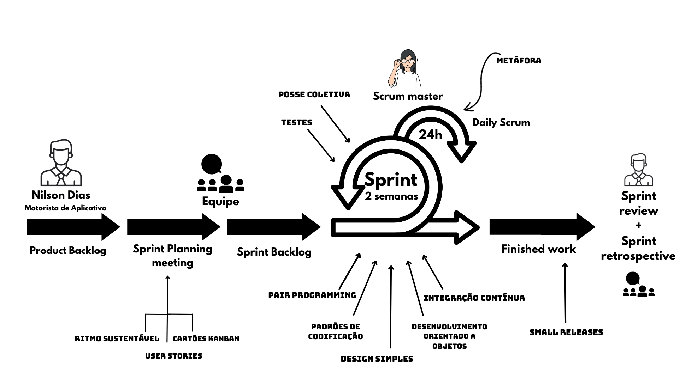

# Processo de Desenvolvimento de Software

Para garantir o sucesso do desenvolvimento durante o projeto, a equipe utilizará como ferramenta de organização a combinação de duas metodologias ágeis: Scrum e XP (Extreme Programming). O Scrum nos possibilitará gerenciar o processo de desenvolvimento em sprints curtos e iterativos, com reuniões e dinâmicas que acontecem com o objetivo de manter todos os membros da equipe alinhados e focados em relação ao projeto. Com o XP, iremos aplicar práticas de programação que asseguram a alta qualidade do código.

A seguir, seguem as principais práticas de ambos que utilizaremos no processo de desenvolvimento de software:

- **Scrum**
    - **Product Backlog** - Será elaborado pelos membros da equipe com apoio assíncrono do Product Owner, com quem será realizada uma conversa para analisar as prioridades e necessidades para com o produto e a equipe.

    - **Sprint Planning Meet** - A equipe decidirá em conjunto o Sprint Backlog, os horários e o formato das dailys da sprint em questão. Esta também será realizada com a participação assíncrona do Product Owner.

    - **Sprint Backlog** - Será realizado pela equipe, sem o auxílio do Product Owner, durante a reunião de planejamento do sprint. A equipe irá classificar os itens do backlog por dificuldade e selecionar, utilizando o sistema empurrado, os itens que serão desenvolvidos ao longo da próxima sprint.

    - **Duração das Sprints** - As sprints terão a duração de 2 semanas, 14 dias corridos. 

    - **Daily** - As dailys ocorrerão diariamente e serão realizadas de forma mista via mensagem de texto e canais de voz, de acordo com a disponibilidade de horário da equipe. Cada membro deve responder as perguntas a seguir: 
        - “O que você fez desde sua última daily?”
        - “Quais foram os impedimentos?”
        - “O que você planeja fazer até a próxima?”

    - **Sprint Review** - Irá ser feito síncrono e assíncrono. Sendo a síncrona com o Product Owner participando da reunião e vendo todos os objetivos desenvolvidos(ou não). E o assíncrono será feito com o Product Owner testando a aplicação e dando os seus feedbacks.

    - **Sprint Retrospective** - Reunião ao fim de sprints e entregas visando exprimir todos os sentimentos e opiniões dos participantes com relação ao andamento do desenvolvimento do produto.

- **XP (Extreme Programming)**
    - **Pair Programming** - Para facilitar e agilizar na solução de problemas e evitar erros, bugs e a refatoração;
    
    - **Padrões de Codificação** - Será seguido os padrões de cada tecnologia e clean code, para evitar bugs, falta de comunicação e refatoração.
    
    - **Posse Coletiva** - Para que a equipe possa se ajudar ao longo do desenvolvimento;
    
    - **Ritmo Sustentável** - Cada Dev se dedicará ao projeto diariamente a fim de que ninguém se sobrecarregue.
    
    - **Metáfora** - Será utilizada para que toda a equipe possa entender os itens do produto;
    
    - **Design Simples** - Manter o código legível e compreensível a fim de ser implantado com testes unitários e automatizados, além de garantir um MVP;
    
    - **Integração Contínua** - Para automatizar as mudanças de código de todos os membros da equipe em único projeto. Permitindo que os membros consigam mesclar os seus códigos onde os builds e os testes serão executados.
    
    - **Testes** - A princípio será utilizado o método de implantar primeiro e testar depois, utilizando testes unitários e automatizados, caso houver necessidade, o TDD será acatado;

